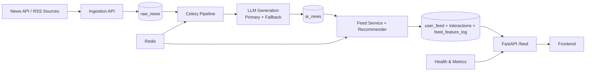

# AI-Driven Personalized News Feed


Personalized news platform with asynchronous AI pipeline, recommendation ranking, and production-focused observability.

## Architecture Diagram



## Pipeline Flow

1. Ingestion stores raw content in `raw_news`.
2. Celery task `brain.process_raw_news` processes each raw item.
3. LLM service generates persona-specific AI variants with retry/cache/fallback.
4. Results are saved to `ai_news` and added to `user_feed`.
5. Recommender ranks feed by similarity, engagement, and freshness.
6. Feed requests are logged as impressions for quality analytics.

## Tech Stack

- Backend: FastAPI, SQLAlchemy Async, Alembic
- Queue/Workers: Celery + Redis
- Data: PostgreSQL (SQLite-compatible fallback in several paths)
- AI: LLM generation with fallback chain
- Frontend: React + Vite
- Testing: Pytest

## Features

- Async ingestion + background processing
- LLM resilience: retry, rate limit, cache, fallback
- Personalized ranking with embeddings and engagement signals
- Health checks: liveness/readiness/system
- Production metrics:
	- Recommendation: CTR, average time spent, recommendation accuracy
	- Pipeline: failed tasks, latency, retry count, pending queue

## Monitoring Endpoints

- `GET /api/health/live`
- `GET /api/health/ready`
- `GET /api/health/system`
- `GET /api/health/metrics`
- `GET /api/health/metrics/recommendations`
- `GET /api/health/metrics/pipeline`

## Demo

- Frontend demo (Vercel): set your URL here after deployment
	- `https://<your-project>.vercel.app`
- Local demo:
	1. Start backend + worker + beat
	2. Start frontend (`npm run dev` in `app/frontend`)
	3. Open frontend and use demo credentials

Demo credentials:
- Email: `demo@example.com`
- Password: `Demo12345!`

## Quick Start

1. Create and activate virtual environment.
2. Configure `.env` at minimum:
	 - `DATABASE_URL`
	 - `REDIS_URL`
	 - `CELERY_BROKER_URL`
	 - `CELERY_RESULT_BACKEND`
	 - LLM API key(s)
3. Run migrations:

```bash
alembic upgrade head
```

4. Start backend:

```bash
uvicorn app.backend.main:app --reload
```

5. Start Celery worker:

```bash
python -m celery -A app.backend.core.celery_app:celery_app worker --loglevel=info --pool=solo
```

6. Start Celery beat:

```bash
python -m celery -A app.backend.core.celery_app:celery_app beat --loglevel=info
```

7. Optional smoke test:

```bash
python scripts/smoke_test.py --base-url http://127.0.0.1:8000
```

## Production Notes

- Heavy LLM operations are executed in pipeline tasks, not per user request.
- Feed endpoint is optimized for serving ranked content, not generating it.
- Keep retry/fallback settings tuned in `app/backend/core/config.py`.